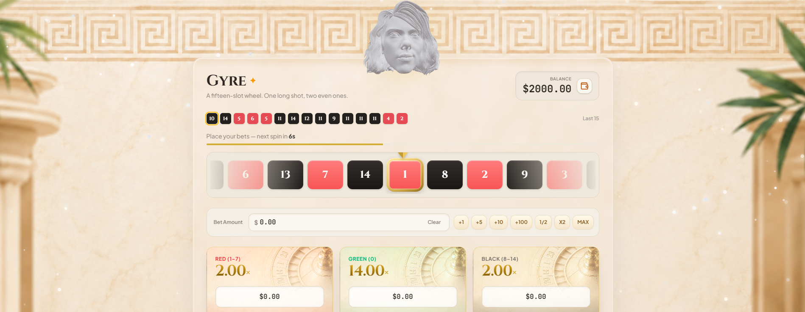

# Gyre Roulette 🎡

> **Disclaimer:** Gyre Roulette is an interactive, play-for-fun browser game. It is built strictly for entertainment purposes using demo credits. No real money is involved.

Gyre Roulette is a modern, interactive 15-slot browser roulette game. It features a provably fair randomness engine, precisely synchronized audio-visual animations, and a fully responsive user interface.

## 🎮 Case Study
[juliusaalto.com](https://juliusaalto.com/projects/gyre-roulette)

## ✨ Features

* 🎲 **Provably Fair Randomness:** Uses the browser's native Web Crypto API (`crypto.getRandomValues()`) and a CSPRNG engine to ensure unbiased and completely random outcomes.
* 🎨 **Modern & Responsive UI:** Built with Tailwind CSS, ensuring a seamless experience across both desktop and mobile devices.
* 🔊 **Synchronized Audio-Visuals:** Custom `cubic-bezier` CSS animations perfectly timed with React `useEffect` audio triggers for an immersive spinning experience.
* ⚡ **Performance Optimized:** Uses React state and `useRef` efficiently to prevent unnecessary re-renders during the animation phases.
* 🪙 **Interactive Micro-interactions:** Powered by Framer Motion for smooth modal popups, rolling balance numbers, and 3D floating coin elements.

## 🛠️ Tech Stack

* **Framework:** [React 18](https://react.dev/)
* **Build Tool:** [Vite](https://vitejs.dev/)
* **Language:** [TypeScript](https://www.typescriptlang.org/)
* **Styling:** [Tailwind CSS](https://tailwindcss.com/)
* **Animations:** [Framer Motion](https://www.framer.com/motion/)

## 🎮 How to Play
* Place your bets: Choose your bet size and place it on Red (2x), Black (2x), or Green (14x).
* Wait for the timer: The game rolls automatically when the 15-second timer hits zero.
* Watch the spin: The wheel spins and lands on a provably fair random number.
* Collect winnings: If the wheel lands on your chosen color, your demo balance increases!
* PS. There is a special animation, if users are hitting green ;).
